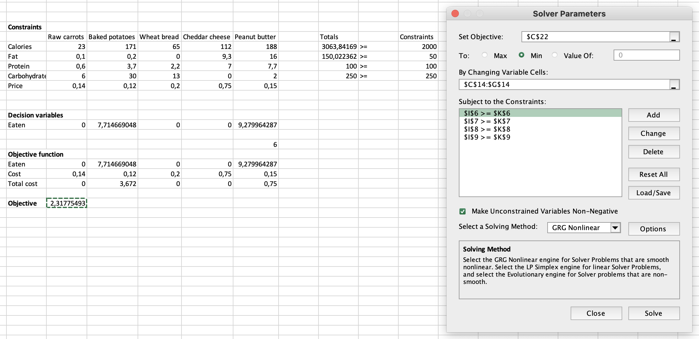
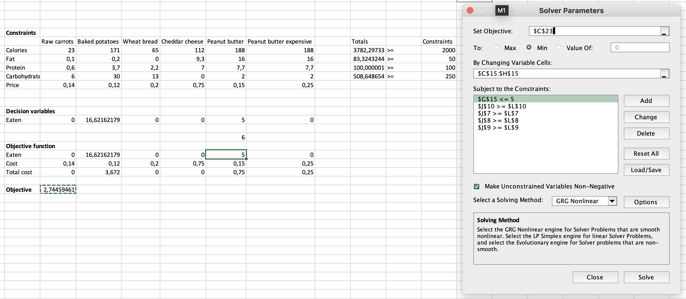
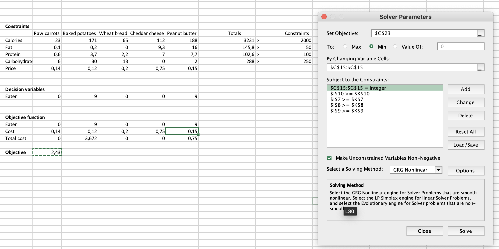

### Exercise 2.1

**a)** The data is read in with the following command:
```{r, results='hide'}
data_sat = read.table("./sat.txt", header=TRUE)
expend = data_sat$expend
ratio = data_sat$ratio
salary = data_sat$salary
takers = data_sat$takers
total = data_sat$total
```

The first technique is the step-up method. This method examines the statistics for each variable and selects the option with the highest r-squared value, given the p-value is significant. This procedure is repeated until the added variable's p-value is no longer statistically significant.
The outcomes are displayed below.

```{r, results='hide'}
# Step-up method
# First round
summary(lm(total~expend)) # multipled R^2 = 0,1448, p-value = 0.00641
summary(lm(total~ratio)) # multipled R^2 = 0.006602, p-value = 0.575
summary(lm(total~salary)) # multipled R^2 = 0.1935, p-value = 0.00139
summary(lm(total~takers)) # multipled R^2 = 0.787, p-value = <2e-16
# Second round
summary(lm(total~takers+expend)) # multipled R^2 = 0.8195, p-value = 0.00553
summary(lm(total~takers+ratio)) # multipled R^2 = 0.7991, p-value = 0.0982
summary(lm(total~takers+salary)) # multipled R^2 = 0.8056, p-value = 0.0394
# Third round
summary(lm(total~takers+expend+ratio)) # multipled R^2 = 0.8227, p-value = 0.3629 
summary(lm(total~takers+expend+salary)) # multipled R^2 = 0.8196, p-value = 0.8527
```

The variable 'takers' will be chosen in the first round and the variable 'expend' in the second round.  We stop after the second round because the p-values for both the ratio and the salary are not statistically significant. Consequently, the step-up method model will be lm(total~takers+expend).
The step-down method does not add variables, but instead begins with a model that contains all variables and then removes options. These are selected using the highest non-significant p-value.
The calculation is displayed below.

```{r, results='hide'}
# Step-down method
# First round
summary(lm(total~takers+expend+ratio+salary)) 
# Second round
summary(lm(total~takers+ratio+salary)) 
```
The variable 'expend' is removed in the first round because it has the highest non-significant p-value.There is no further removal of variables as all variables have significant p-values.
The statistics for the step-up method are as follows: multiple r-squared = 0.8195 and p-value = < 2.2e-16.
For the step-down method it is: multiple-r^2 = 0.8239 and p-value = < 2.2e-16
Given these numbers, the model with the greatest r-squared multiple would be preferred. However, as the difference is very small, we also consider the model's complexity. The step-up method utilizes only two variables, whereas the step-down method has three. Therefore, the former is easier. In this situation, we would prefer the step-up method due to the fact that their performance is nearly identical.

**b)**
The variable takers2 is the square of the takers values. This is followed by the step-up method.
```{r, results='hide'}
takers2=(data_sat$takers)^2
takers;takers2
# Step-up method
# First round
summary(lm(total~expend)) # multipled R^2 = 0,1448, p-value = 0.00641
summary(lm(total~ratio)) # multipled R^2 = 0.006602, p-value = 0.575
summary(lm(total~salary)) # multipled R^2 = 0.1935, p-value = 0.00139
summary(lm(total~takers)) # multipled R^2 = 0.787, p-value = <2e-16 
summary(lm(total~takers2)) # multipled R^2 = 0.6578, p-value = 9.28e-13
# Second round
summary(lm(total~takers+expend)) # multipled R^2 = 0.8195, p-value = 0.00553 
summary(lm(total~takers+ratio)) # multipled R^2 = 0.7991, p-value = 0.0982
summary(lm(total~takers+salary)) # multipled R^2 = 0.8056, p-value = 0.0394
summary(lm(total~takers+takers2)) # multipled R^2 = 0.8732, p-value = 8.96e-07
# Third round
summary(lm(total~takers+takers2+expend)) # multipled R^2 = 0.8859, p-value = 0.0285 
summary(lm(total~takers+takers2+ratio)) # multipled R^2 = 0.8738, p-value = 0.634
summary(lm(total~takers+takers2+salary)) # multipled R^2 = 0.8858, p-value = 0.029 
# Fourth round
summary(lm(total~takers+takers2+expend+ratio)) # multipled R^2 = 0.8887, p-value = 0.2936
summary(lm(total~takers+takers2+expend+salary)) # multipled R^2 = 0.8873, p-value = 0.466
```
In the first round, the variable ‘takers’ is selected, followed by the variable ‘takers2’ and finally the variable ‘expend’. We stop after the third round because the variables added in the fourth round do not have a significant p-value.

The step-down method is shown below:
```{r, results='hide'}
# First round
summary(lm(total~takers+takers2+expend+ratio+salary)) # remove salary since it has the highest p-value that is not significant
# Second round
summary(lm(total~takers+takers2+expend+ratio)) # remove ratio as it has the highest p-value that is not significant
# Third round
summary(lm(total~takers+takers2+expend)) # all variables have a significant p-value, so stop removing

```
The variable takers2 is included in both the step-up and step-down models, making its addition useful.Both have got three variables so they are equally complex. 
Since both models are identical, it makes no difference which method is chosen, as both will result in the same model.
<!-- The statistics for the step-up method are: multiple r-squared = 0.8195 and p-value = < 2.2e-16 -->
<!-- For the step-down method it is: multiple r-squared = 0.8859 and p-value = < 2.2e-16 -->
<!-- Due to the fact that the multiple r-squared is greater and the p-value is significant for the step-down method, we would choose this method. -->

**c)**
The model in exercise a has an r-squared multiple of 0.8194 and a p-value less than 2.2e-16. Multiple r-squared value of 0.8859 and a p-value less than 2.2e-16 are the statistical results for the model selected in exercise b. However, the first model uses only two variables, while the second model utilises three. We prefer the multiple r-squared value over the complexity of the model and thus select the second model. 


<!-- The step-up method has got four variables while the step-down method has only got three variables. We would opt for a simpler model and thus the latter. -->
<!-- For the step-up method it's like this: multiple-r^2 = 0.8859 and p-value = < 2.2e-16 -->
<!-- For the step-down method it's like this: multiple-r^2 = 0.8859 and p-value = < 2.2e-16 -->
<!-- The values are exactly the same, so we would opt for the simpler model. -->


**d)**

```{r, results='hide'}
summary(lm(total~takers+takers2+expend))
chosen_model = lm(total~takers+takers2+expend)
# model = 1052 - 6.381 * takers + 0.04741 * takers2 + 7.914 * expend
newxdata = data.frame(expend=5, takers2=625, salary=36000, takers=25)
predict(chosen_model,newxdata,interval="prediction",level=0.95)
# Fit = 961.5703; lwr = 907.6003; upr = 1015.54;
```

The fit is 961.57, the lowerbound 907.6 and the upperbound 1015.54.


### Exercise 2.2

```{r}
df = read.table("./treeVolume.txt", header=TRUE)
```

**a)**

We assume that there is no hidden relationship between measurements. We also need to know if the data is normalized.
```{r}
shapiro.test(df$diameter);shapiro.test(df$volume);shapiro.test(df$height);
par(mfrow=c(3,3));
qqnorm(df$diameter, main="QQ-plot diameter");qqnorm(df$volume, main="QQ-plot volume");qqnorm(df$height, main="QQ-plot height");
hist(df$diameter, main="Histogram diameter");hist(df$volume, main="Histogram volume");hist(df$height, main="Histogram height");
boxplot(df$diameter, main="Boxplot diameter");boxplot(df$volume, main="Boxplot volume");boxplot(df$height, main="Boxplot height")
```

The data follows a fairly normal distribution, as far as we can know with the limited dataset.

Next, we will model the differences in the mean of the volume, as a function of the type of tree:

```{r}
# Does the type affect the volume?
fit = aov(volume ~ type, data=df)
summary(fit)
```

The F value is not high, which means there is little variation between groups. Furthermore, the p value is not below 0.05. Therefore it seems (in this test) that the tree type does not have an significant effect on the volume.


```{r}
par(mfrow=c(1,2));
boxplot(df[df$type == "beech",]$volume, main="Beech volume");
boxplot(df[df$type == "oak",]$volume, main="Oak volume")
```

However, graphing the data shows that an oak does in fact seem to have a higher mean volume compared to a beech, just not significant enough. The variance looks about the same.

**b)**
Now, we'll include diameter and height into the analysis, performing an ANCOVA test:

```{r}
lm2 = lm(volume ~ diameter + height + type, data=df)
fit2 = anova(lm2)
fit2
```

With this included, we see that the type is still not a big influence. The p-value is 0.143, indicating that the difference between the means is not significant.
```{r}
lm2
```
This shows that the oak type negatively influences the volume (-1.3046). 

Estimated volumes for the two tree types:

```{r}
predict(lm2, newdata=data.frame(height=mean(df$height), diameter=mean(df$diameter), type="beech"))
predict(lm2, newdata=data.frame(height=mean(df$height), diameter=mean(df$diameter), type="oak"))
```

A graphical investigation how the diameter influences the volume:

```{r}
par(mfrow=c(1,2))
pairs(split(df, df$type)$beech[c('volume', 'diameter', 'height')], main="Beech")
pairs(split(df, df$type)$oak[c('volume', 'diameter', 'height')], main="Oak")
```
For both tree types, the volume and diameter show a clear relation (straight line). The relation also seems present in both tree types.

**c)**
We can square the volume, as the diameter and height can be seen similar to a multiplication that results in the volume (diameter * height = volume).

```{r}
lm3 = lm(volume ~ diameter + height, data=df)
lm4 = lm(sqrt(volume) ~ diameter + height, data=df)

par(mfrow=c(1,2))
plot(residuals(lm3))
plot(residuals(lm4))
```

By doing so we can see the residuals going down a lot, which would improve the fit.

### Exercise 2.3

**a)**
The calculation made in cell C23 is '=SUMPRODUCT(C19:G19;C20:G20)'. For cell I7 it is '=SUMPRODUCT(C7:G7;C19:G19)', cell I8 '=SUMPRODUCT(C8:G8;C19:G19)', cell I9 '=SUMPRODUCT(C9:G9;C19:G19)' and cell I10 '=SUMPRODUCT(C10:G10;C19:G19)'.
The image depicts the calculations performed in Excel solver.  
The products and nutrients are swapped because it was simpler to construct the Excel solver in this manner.The solution is 0 raw carrots, 7,71 baked potatoes, 0 wheat bread, 0 cheddar cheese, and 9,28 peanut butter. 
<!-- Mention the calculations made in objective and totals? -->


**b)**
The same calculations in cells I7, I8, I9, and I10 are made as was done in exercise a), but cell C23 is now '=SUMPRODUCT(C19:H19;C20:H20)'.
The calculation has been modified slightly because the price of peanut butter increases after the fifth unit. Therefore, a new column ('Peanut butter expensive') containing the same nutrients but at a higher price is added. Additionally, a new constraint has been added so that the quantity of inexpensive peanut butter units cannot exceed five units.The solution is 0 raw carrots, 16,62 baked potatoes, 0 wheat bread, 0 cheddar cheese, 5 cheap peanut butter, and 0 expensive peanut butter. 



**c)**
The data used in this exercise is the same as the one in exercise a). The calculations made in this exercise are also the same, but with the additional constraint that the decision variables must be integers.The solution is 0 raw carrots, 9 baked potatoes, 0 wheat bread, 0 cheddar cheese, and 9 peanut butter. 



### Exercise 2.4

**a)**

The transportation problem is a simple constraint problem. Letting the constraint to both that the demand should at least match the given demand, while the supply may at most be the given supply, the solver will solve the problem.


**b)**
This model is an extension to the one in a). To incorporate the extra cost, we will add a binary variable matrix to act as a usage constraint. This constraint will enable a large value (100000 in our case) in a matrix of parameters when enabled, and zero when disabled. Then, another constraint is added to let the path decision matrix be at most the value in this matrix. This means that, when the solver wants to use a path, the binary variable has to be set to one, so that the path limit is unlimited. If the path is not used, the maximum value allowed is zero, effectively disabling the path. And finally, in the objective the sum is taken from the using path matrix, multiplied by the path usage cost (100). So when a path is used, this usage cost is added to the objective.


### Exercise 2.5

**a)**
The problem is formulated as an Integer Linear Programming (ILP) problem, using the following setup:

In this setup, all possible shifts (8-hour and 4-hour shifts starting between mentioned times) are presented in a matrix format. The cost per shift (# hours * hourly wage) and the required number of workers can also be found in this setup. The amount of shifts of a specific type can be found in the column “amount”. The number of workers per interval is corresponding to the amount of shifts per type. Lastly, our objective is the total costs (sum of (amount per shift type* cost per shift)). By adjusting the column “amount” (decision variables) with the constraints that the amounts should be integers and that the number of workers satisfy the minimum requirement, we are minimizing our objective (total costs). This is done by using the integrated solver of Excel, as follows:

The resulting objective value is 3296. This denotes that the minimum cost to cover all intervals with the required number of workers is equal to 3296 euro.


**b)**
To answer this question, the same formulation as above is used with some adjustments:
-	4-hour shifts are removed.
-	Instead of a required number of workers, there is a demanded number of workers. This changes the problem in the way that it is also possible that in some cases the demanded number of workers is not reached (understaffed). In part a, it was only possible to have more scheduled workers than required (overstaffed), because the required number was a hard minimum. Now both situations are possible.
-	The objective value is now the total absolute difference between the demanded number of workers and the scheduled number of workers. By solving this ILP, we are minimizing this difference. A low objective value corresponds to reliability in scheduling the demanded amount of workers. 


As before, the integrated solver of excel (with the adjustments above) is used to solve this problem. As can be seen, the resulting objective value is 63. So the schedule that minimizes the sum of absolute differences between the demanded and scheduled amount of workers has an outcome of 63.
