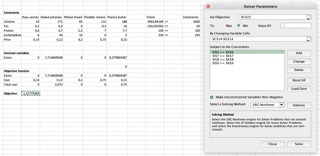
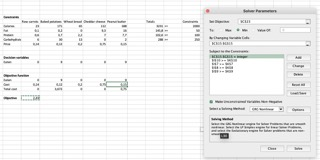

```{r setup, include=FALSE}
install.packages("ggplot2")

library(ggplot2)

knitr::opts_chunk$set(echo = TRUE)
```

### Exercise 2.1

**a)** The data is read in with the following command:
```{r}
data_sat = read.table("./sat.txt", header=TRUE)
expend = data_sat$expend
ratio = data_sat$ratio
salary = data_sat$salary
takers = data_sat$takers
total = data_sat$total
```

The first method is the step-up method. This method checks the statistics for every single variable and chooses the option that yields the highest multiple r-squared as long as the p-value is significant.
The results are shown below.

```{r}
# Step-up method
# First round
summary(lm(total~expend)) # multipled R^2 = 0,1448, p-value = 0.00641
summary(lm(total~ratio)) # multipled R^2 = 0.006602, p-value = 0.575
summary(lm(total~salary)) # multipled R^2 = 0.1935, p-value = 0.00139
summary(lm(total~takers)) # multipled R^2 = 0.787, p-value = <2e-16 --> choose this one first
# Second round
summary(lm(total~takers+expend)) # multipled R^2 = 0.8195, p-value = 0.00553 --> choose this one second
summary(lm(total~takers+ratio)) # multipled R^2 = 0.7991, p-value = 0.0982
summary(lm(total~takers+salary)) # multipled R^2 = 0.8056, p-value = 0.0394
# Third round
summary(lm(total~takers+expend+ratio)) # multipled R^2 = 0.8227, p-value = 0.3629 
summary(lm(total~takers+expend+salary)) # multipled R^2 = 0.8196, p-value = 0.8527
# stop after second round as the p-values are both not significant
```

We stop after the third round as the p-value for both the ratio as the salary is not significant. Therefore, the model using the step-up method will be: lm(total~takers+expend).
The step-down method does not add up varibles, but starts with a model that has got all variables included and strips down options. These are chosen by taking the highest p-value that is nog significant. 
The calculation are shown below.

```{r}
# Step-down method
# First round
summary(lm(total~takers+expend+ratio+salary)) # remove expend since it has the highest p-value that is not significant
# Second round
summary(lm(total~takers+ratio+salary)) # all variables have a significant p-value, so stop removing
```

Both have got three variables, but numbers step-up method are: multiple-r^2 = 0.8195 and p-value = < 2.2e-16
For the step-down method it's like this: multiple-r^2 = 0.8239 and p-value = < 2.2e-16
As the multiple-r^2 is higher for the step-down method and the p-value is significant, we would choose this one. 

The step-up method has got two variables while the step-down method has got three variables. The simpler the model, the better. Therefore, we would choose the model that the step-up method made. 

**b)**
The variable takers2 is the square of the takers values. This is followed by the step-up method.
```{r}
takers2=(data_sat$takers)^2
takers;takers2
# Step-up method
# First round
summary(lm(total~expend)) # multipled R^2 = 0,1448, p-value = 0.00641
summary(lm(total~ratio)) # multipled R^2 = 0.006602, p-value = 0.575
summary(lm(total~salary)) # multipled R^2 = 0.1935, p-value = 0.00139
summary(lm(total~takers)) # multipled R^2 = 0.787, p-value = <2e-16 --> choose this one first
summary(lm(total~takers2)) # multipled R^2 = 0.6578, p-value = 9.28e-13
# Second round
summary(lm(total~takers+expend)) # multipled R^2 = 0.8195, p-value = 0.00553 
summary(lm(total~takers+ratio)) # multipled R^2 = 0.7991, p-value = 0.0982
summary(lm(total~takers+salary)) # multipled R^2 = 0.8056, p-value = 0.0394
summary(lm(total~takers+takers2)) # multipled R^2 = 0.8732, p-value = 8.96e-07 --> choose this one second
# Third round
summary(lm(total~takers+takers2+expend)) # multipled R^2 = 0.8859, p-value = 0.0285 --> choose this oen third
summary(lm(total~takers+takers2+ratio)) # multipled R^2 = 0.8738, p-value = 0.634
summary(lm(total~takers+takers2+salary)) # multipled R^2 = 0.8858, p-value = 0.029 
# Fourth round
summary(lm(total~takers+takers2+expend+ratio)) # multipled R^2 = 0.8887, p-value = 0.2936
summary(lm(total~takers+takers2+expend+salary)) # multipled R^2 = 0.8873, p-value = 0.466
# --> stop after third round as both p-values are not significant
```

The step-down method is shown below:
```{r}
# First round
summary(lm(total~takers+expend+ratio+salary)) # remove expend since it has the highest p-value that is not significant
# Second round
summary(lm(total~takers+ratio+salary)) # all variables have a significant p-value, so stop removing

```

Both have got three variables, but numbers step-up method are: multiple-r^2 = 0.8195 and p-value = < 2.2e-16
For the step-down method it's like this: multiple-r^2 = 0.8239 and p-value = < 2.2e-16
As the multiple-r^2 is higher for the step-down method and the p-value is significant, we would choose this one. 

**c)**
The step-up method has got four variables while the step-down method has only got three variables. We would opt for a simpler model and thus the latter.
For the step-up method it's like this: multiple-r^2 = 0.8859 and p-value = < 2.2e-16
For the step-down method it's like this: multiple-r^2 = 0.8859 and p-value = < 2.2e-16
The values are exactly the same, so we would opt for the simpler model.


**d)**

```{r}
summary(lm(total~takers+takers2+expend))
chosen_model = lm(total~takers+takers2+expend)
# model = 1052 - 6.381 * takers + 0.04741 * takers2 + 7.914 * expend
newxdata = data.frame(expend=5, takers2=625, salary=36000, takers=25)
predict(chosen_model,newxdata,interval="prediction",level=0.95)
# Fit = 961.5703; lwr = 907.6003; upr = 1015.54;
```


### Exercise 2.2

TODO: run assumptions


**a)**
```{r}
df = read.table("./treeVolume.txt", header=TRUE)

# Does the type affect the volume?
fit = aov(volume ~ type, data=df)
#summary(treevollm) 
summary(fit)
```

The F value is not very high, and the p value is not very small. Therefore it seems (in this test) that the volume is not dependent on the type.

TODO: explain more

```{r}
ggplot(df, aes(y=volume, x=type, fill=type))+
  stat_summary(fun.y="mean", geom="bar",position="dodge")+
  stat_summary(fun.data = mean_se, geom = "errorbar", position="dodge",width=.8)

```

TODO explain chart

**b)**
```{r}

fit2 = aov(volume ~ type + diameter + height, data=df)
summary(treeancovalm)
```
```{r}
predict()

```


### Exercise 2.2
**a)**

**b)**

**c)**



## R Markdown

This is an R Markdown document. Markdown is a simple formatting syntax for authoring HTML, PDF, and MS Word documents. For more details on using R Markdown see <http://rmarkdown.rstudio.com>.

When you click the **Knit** button a document will be generated that includes both content as well as the output of any embedded R code chunks within the document. You can embed an R code chunk like this:

```{r cars}
summary(cars)
```

## Including Plots

You can also embed plots, for example:

```{r pressure, echo=FALSE}
plot(pressure)
```

Note that the `echo = FALSE` parameter was added to the code chunk to prevent printing of the R code that generated the plot.
