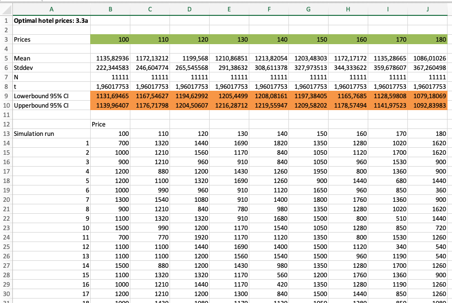
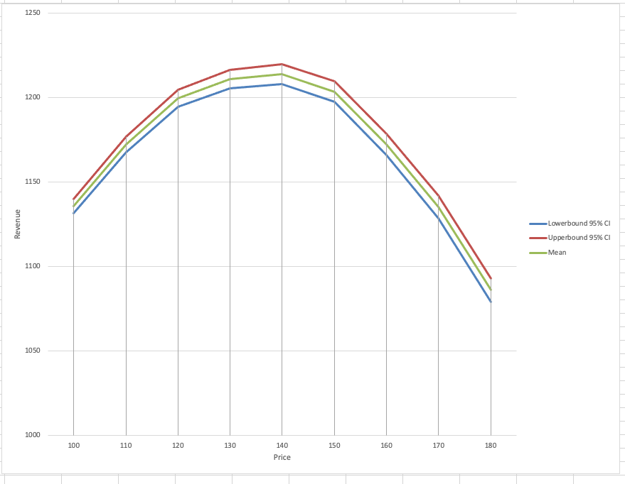
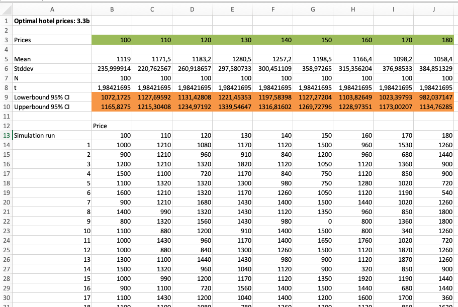
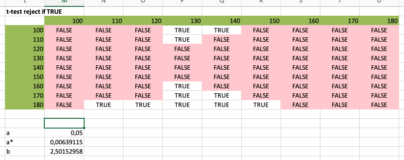
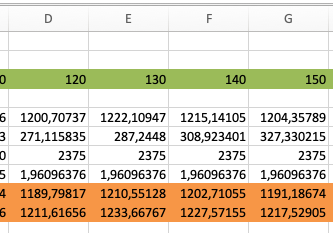
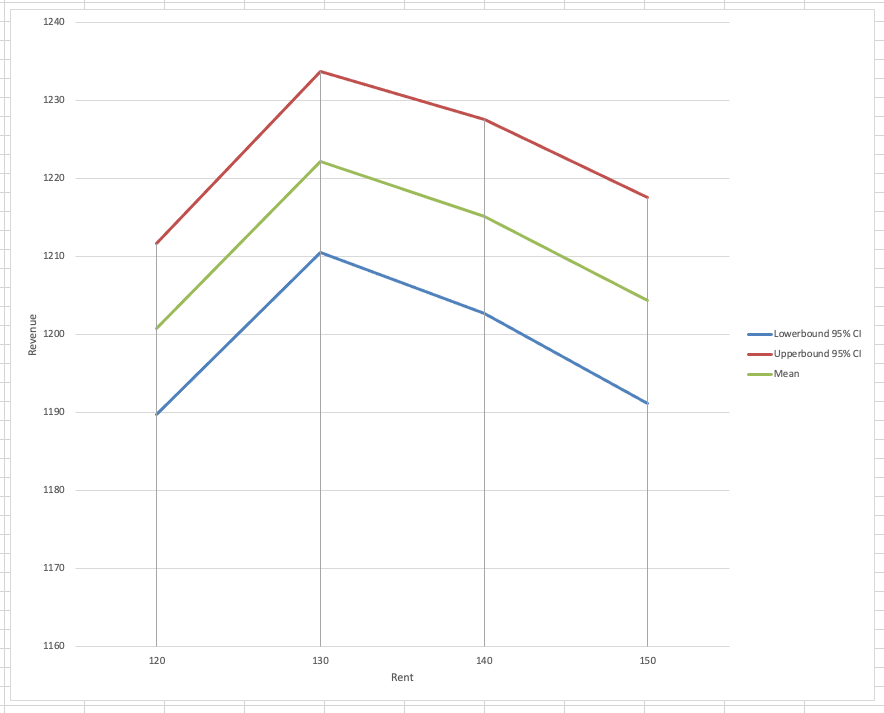

### Exercise 3.1

### Exercise 3.2

### Exercise 3.3

**a)** 
We can simulate the hotel room rent in excel by using multiple rows for random, binomial formulas. We arranged the data in a table (see appendix 3.3a table). With a simulation budget of 100000, we will use 100000 / 9 = 11111 rows.

When graphed (appendix 3.3b), we can see that the 140 mark is the cost with the highest estimate revenue.

We use a t-test for these calculations. The t-test is done in excel by estimating the mean, std. dev, and t value. From this, a lower- and upperbound confidence interval is calculated. These are also graphed in 3.3b. 

**b)**
To execute the steps in "ranking and selection, option 2" we can reuse the sheet created in 3.3a. With a starting budget of 900, and 9 prices, we first simulate 900 / 9 = 100 rows. These are shown in appendix 3.3c. 

Next, we perform pairwise t-test for each price. We can do this in Excel by creating a 9 by 9 table containing the test: $y(\pi) \le y(\pi') - \beta_{1-\alpha} \frac{\sqrt{s^2(\pi) + s^2(\pi')}}{\sqrt(N)}$. The results of these tests are in appendix 3.3d. With this, we can reject the prices 100, 100, 160, 170, 180.

To continue, we execute step 4, which is to perform the rest of the testing budget. This is 9100 / 9 = 1011 rows. The end result is shown in appendix 3.3e and 3.3f. Now, the maximum revenue is estimated to be with 130. 

An important note is that these values are generated by a random number generated, which resets between each simulation. Therefore, these test may show different results. Nonetheless, if simulated enough, the result should weight to a single price point eventually.

### Appendix

 

 

 

 
 

 
