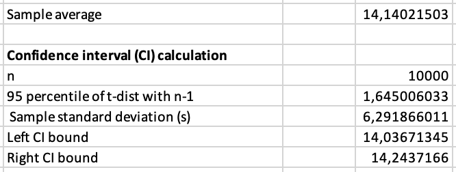

### Exercise 3.1

**A)**

To solve this problem, first the Pulp package is imported. The
parameters (jobs, duration, release times etc.) are created and set to
the values as described in the assignment. Then, the decision variables
x (starting times) and y (binary variable that indicates wheter a
certain job is being processed on a specific time or not) are created.
Following that, the objective (sum of all costs (z)) is set. This can be
summarized as the data part (as asked in the assignment) and can be
easily adjusted to the context of a new problem.

From here, several constraints of the model are added. These constraints
include facts as that a job can only start after it is released, that
the machine can only work on 1 job at a time and that a job has to be
finished before its due date. After all the constraints are added, the
build-in solver is called to solve the problem.


The above output and the values of all the variables can be interpreted
as follows:

\- The gained solution is the optimal solution. The optimal schedule is
[9,6,1,2,5,3,4,8,7,10] with total costs (objective value) 24.0.\
- The starting times per job (in the order of the jobs in the optimal
schedule above) are: [0.0, 2.0, 3.0, 7.0, 12.0, 19.0, 22.0, 27.0, 30.0,
30.0] \
- The finishing times (in the order of the jobs in the optimal
schedule above) are: [2.0, 3.0, 7.0, 12.0, 19.0, 22.0, 27.0, 30.0, 30.0,
40.0] 

\- The tardiness per job (in the order of the jobs in the optimal
schedule above) is: [0.0, 0.0, 0.0, 0.0, 0.0, 2.0, 2.0, 0.0, 0.0, 20.0]

**B)**

The additional requirement is added to the model as an extra constraint
in the form of an if-else statement, as can be seen below:


\
Except for this small addition to the constraints part, the rest of the
model has remained the same as in part a. This model resulted in the following
solution:


As before, this can be interpreted as follows:

\- The gained solution is the optimal solution. The optimal schedule is
[6,9,2,1,3,4,8,7,5,10] with total costs (objective value) of 40.0.\
- The starting times per job (in the order of the jobs in the optimal schedule
above) are: [0.0, 2.0, 4.0, 10.0, 14.0, 17.0, 23.0, 26.0, 26.0, 34.0] \
- The finishing times (in the order of the jobs in the optimal schedule above)
are: [1.0, 4.0, 9.0, 14.0, 17.0, 22.0, 26.0, 26.0.0, 33.0, 44.0] 

\- The tardiness per job (in the order of the jobs in the optimal
schedule above) is: [0.0, 0.0, 0.0, 3.0, 0.0, 0.0, 0.0, 0.0, 13.0,
24.0]\
- The corresponding sieve types (in the order of the jobs in the optimal
schedule above) are: [1, 2, 2, 1, 1, 1, 2, 2, 2, 1].\

**Exercise 3.2**

The project is calculated in Excel, as shown in Figure 1 of the
appendix. The expected durations for each activity are displayed in
columns B16 through H16. All activity durations are independent
and distributed exponentially. In addition, the duration follows an
exponential distribution with a parameter of 1/4. The inverse transformation method for exponential distribution must be used
as these are expected durations. The calculation in Excel is: '-ln(rand()) / "lambda"'. Lambda
is the same as the rate parameter so this will be 1/4. This function is
used to calculate the realizations of activity durations for the seven
activities in de cells B24 until H10023. So for example, the calculation
made in cell B20 is '=-(LN(RAND())/(1/\$B\$16))'. Realizations of finish
time activities are calculated in cells I24 untill O10023. This is done
by adding the duration of the activity with the duration of the former
one. So for example, for activity 2 it is the duration of activity 1 plus activity 2 (see appendix Table 2).
However, for activity 5 it is the maximum duration of activity 2 and 3 plus the activity of activity 5 (see appendix Table 2).
This is because the activity five has to wait for both activity two as well as three to finish. The max makes sure
that the longest of those two activities gets chosen as activity five
can only start once both previous activities are finished.

**a)**

We can assume that the central limit theorem applies since the project
has to be simulated 10000 times. The expected project finish time will
be the average project finish time of those 10000 simulations. That
calculation is shown in appendix Table 1 and the result is 13,958 (see
appendix Figure 2).

**b)**

The confidence interval is calculated using the t-test. The use of the
t-test is possible as the we can assume a normal distribution (as
described above) and we don't know anything about the population
standard deviation, but do know the sample standard deviation. The
confidence interval looks as follows:

$$
[\overline X - t_{a/2, n - 1}\frac{s}{\sqrt{n}}, \overline X + t_{a/2, n - 1}\frac{s}{\sqrt{n}}]
$$ Where $\overline X$ = expected project finish time (which is the
average expected project finish time), $n$ = number of sample values,
$s$ = sample standard deviation, and $t$ is the t-distribution.

The calulations are shown in appendix Table 1. These give a confidence
interval of [13,859; 14,058] (see appendix Figure 2). This means that we
are 95% confident that the mean lies within this interval. So, if we
would run this project several times and calculate the project finishing
time, the mean would lie in this interval for 95% of the cases.

**c)**

The probability that the expected project time takes longer is
calculated in Excel with the function
'=(COUNTIF(P24:P10023;"\>12")/10000)'. P24:P10023 are the 10000 expected
project durations. This results in a probability score of 0,5815 (is
58,15%). The confidence interval is then calculated in the same way as
described in exercise 3.3 b. The results are shown in appendix Figure 3.
The 95% confidence interval is thus: [14,037;14,244]

<!-- We start with the following null-hypothesis and alternative hypothesis: -->

<!-- $$ -->

<!-- H_0: \text{expected project duration} \le 12 -->

<!-- $$ -->

<!-- $$ -->

<!-- H_0: \text{expected project duration} > 12 -->

<!-- $$ -->

<!-- Then, we can use a t-test. We are going to use a t-test since we concluded in question a) that the central limit theorem applies and the standard deviation is unknown (see slide 22, lecture 2). -->

<!-- The probability that an expected project time is calculated using the test statistic T: -->

<!-- $$ -->

<!-- T = \frac{\overline X - \mu}{\frac{s}{\sqrt{n}}} -->

<!-- $$ -->

<!-- Where $\overline X$ = expected project finish time, $\mu$ = is the average expected project finish time, $s$ = the sample standard deviation, and $n$ = number of sample values.  -->

<!-- Excel's calculation is shown in appendix Table 1. The T-value is then used to calculate the p-value (see appendix Table 1).The p-value is 0,362 and the confidence interval is [11,883; 12,076]. Since the p-value is not lower than 0,05, we conclude that there is not enough statistical evidence to reject $H_0$. This can also be checked by looking at the interval. 12 lies within that interval which also means that we can not reject $H_0$.  -->

### Exercise 3.3

**a)** We can simulate the hotel room rent in excel by using multiple
rows for random, binomial formulas. We arranged the data in a table (see
appendix 3.3a table). With a simulation budget of 100000, we will use
100000 / 9 = 11111 rows.

When graphed (appendix 3.3b), we can see that the 140 mark is the cost
with the highest estimate revenue.

We use a t-test for these calculations. The t-test is done in excel by
estimating the mean, std. dev, and t value. From this, a lower- and
upperbound confidence interval is calculated. These are also graphed in
3.3b.

**b)** To execute the steps in "ranking and selection, option 2" we can
reuse the sheet created in 3.3a. With a starting budget of 900, and 9
prices, we first simulate 900 / 9 = 100 rows. These are shown in
appendix 3.3c.

Next, we perform pairwise t-test for each price. We can do this in Excel
by creating a 9 by 9 table containing the test:
$y(\pi) \le y(\pi') - \beta_{1-\alpha} \frac{\sqrt{s^2(\pi) + s^2(\pi')}}{\sqrt(N)}$.
The results of these tests are in appendix 3.3d. With this, we can
reject the prices 100, 100, 160, 170, 180.

To continue, we execute step 4, which is to perform the rest of the
testing budget. This is 9100 / 9 = 1011 rows. The end result is shown in
appendix 3.3e and 3.3f. Now, the maximum revenue is estimated to be with
130.

An important note is that these values are generated by a random number
generated, which resets between each simulation. Therefore, these test
may show different results. Nonetheless, if simulated enough, the result
should weight to a single price point eventually.

### Appendix


```{r echo=FALSE, message=FALSE, warning=FALSE}
my_tbl <- tibble::tribble(
       ~Name, ~Calclulation,
  "Sample average", '=AVERAGE(Q23:Q10022)',
  "N" , '=COUNT(Q23:Q10022)',
  "95 percentile of t-dist with n-1 " , '=T.INV(0,95;U28-1)',
  "Sample standard deviation (s)" , '=STDEV.S(Q23:Q1122)',
  "Left CI bound" , '=U25-U29*U30/SQRT(U28)',
  "Right CI bound" , '=U25+U29*U30/SQRT(U28)',
  "Test statistic T" , '=(12-T39)/(T44/SQRT(T42))',
  "P-value" , '=TDIST(T48;(T42-1);1)'
  )

require(knitr)
kable(my_tbl, digits = 3, row.names = FALSE, align = "l",
              caption = "Formulas used")
```


```{r echo=FALSE, message=FALSE, warning=FALSE}
my_tbl <- tibble::tribble(
       ~Activity, ~Calclulation,
  "1", '=B24',
  "2" , '=I24+C24',
  "3" , '=I24+D24',
  "4" , '=I24+E24',
  "5" , '=MAX(J24;K24)+F24',
  "6" , '=MAX(K24;L24)+G24',
  "7" , '=MAX(M24;N24)+H24'
  
  )

require(knitr)
kable(my_tbl, digits = 3, row.names = FALSE, align = "l",
              caption = "Formulas used per activity")
```





 


